
<h1 align="center">实验室仪器设备管理系统</h1>

## 简介
实验室仪器设备管理系统：角色分为管理员和学生；功能包括学生管理、设备管理、实验室管理、公告管理、预约管理、数据管理，支持信息筛选、文件上传及多种操作模块，提升管理效率。    --计算机毕业设计源码；毕设源码；java毕业设计源码

## 联系方式

<h3 align="center">获取完整代码与数据库文件 + 微信：deepguan QQ: 86050149 QQ群: 783742310</h3>

<h3 align="center">可帮忙远程部署 包运行成功！提供远程部署、修改代码、设计文档指导、代码讲解等服务！</h3>

## 功能介绍（完整见运行截图）
管理员： 基本功能包括登录和注册以进入系统，通过用户管理功能可以添加和维护学生信息，包括账号管理、身份验证、照片上传等；设备管理模块允许管理员查看和编辑设备列表，支持设备添加和状态更新；实验室管理中，可管理实验室类型和预约信息并进行审批；公告管理模块用于发布和维护系统公告；其他功能包括违规管理和数据管理，提供导航栏便于在各功能模块间切换，提高资源管理效率。

学生： 基本功能包括使用个人账号登录系统，完成信息维护如个人信息查看与编辑，照片上传等；系统提供实验室设备预约功能，学生可提交预约申请及相关文件，并查看审批状态；学生管理模块允许学生查看个人信息及设备使用记录；设备管理中，学生可查看借用设备的状态和记录，确保及时归还；在公告管理模块中，学生可以查看最新公告，保持对实验室动态的了解。

管理人员： 提供实验室和设备管理支持，可通过列表查看、筛选实验室及设备信息，管理人员可以新增、编辑实验室类型和设备状态；系统数据显示功能便于追踪预约申请及使用记录，受到权限控制，是后台管理和数据分析的重要环节；基础数据管理功能帮助管理实验室的条目，如实验室类型的信息管理和批量操作，提升了数据维持的操作便捷性。

## 运行截图
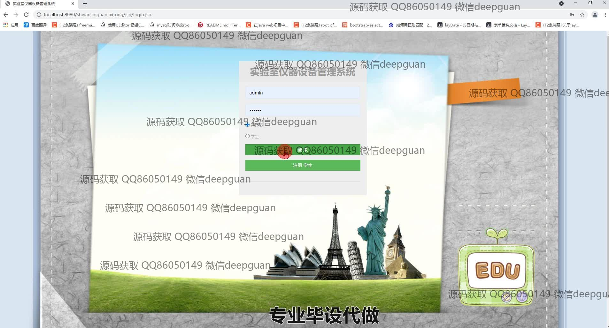
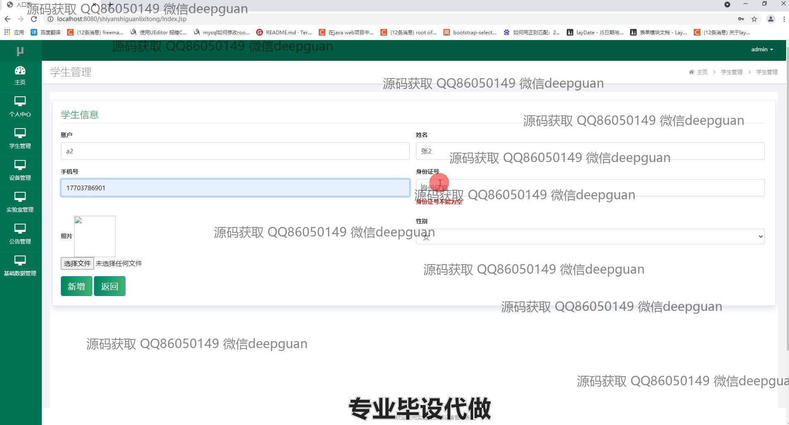
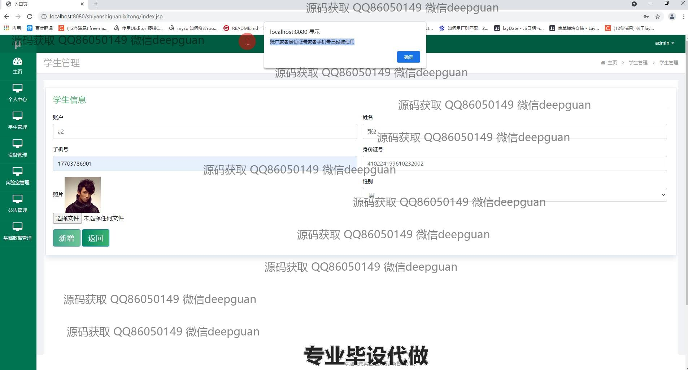
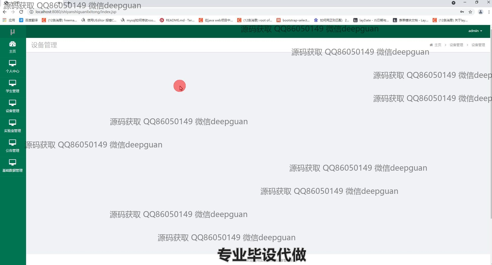
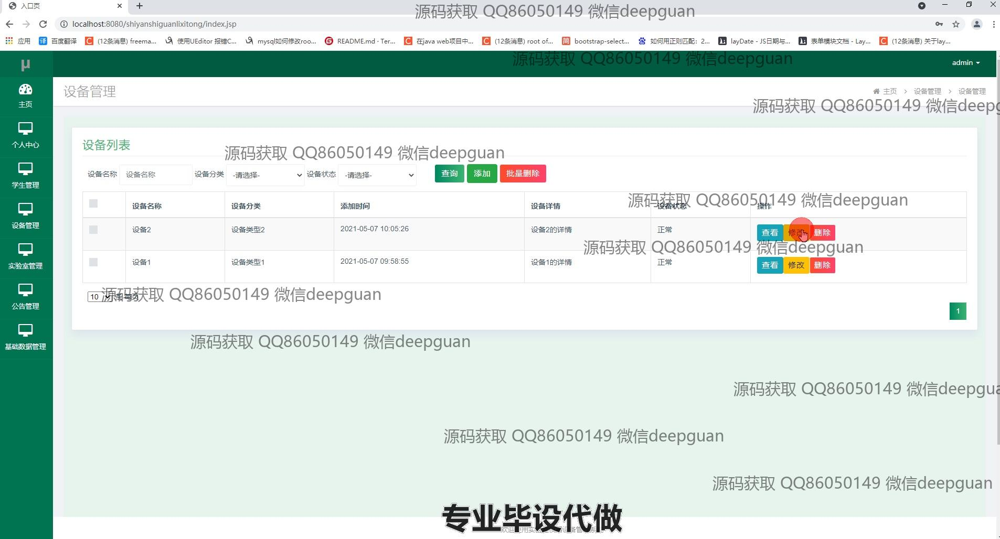
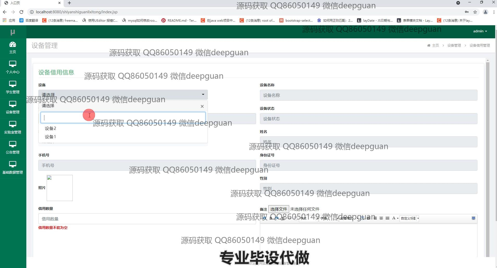
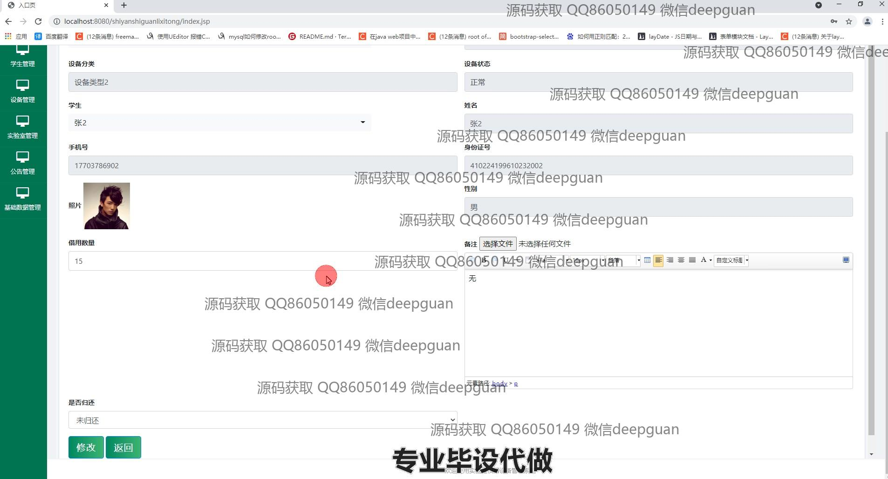
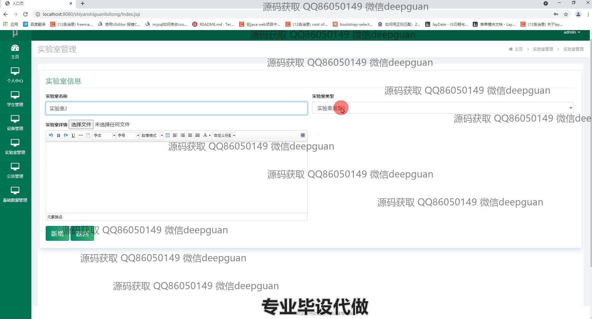
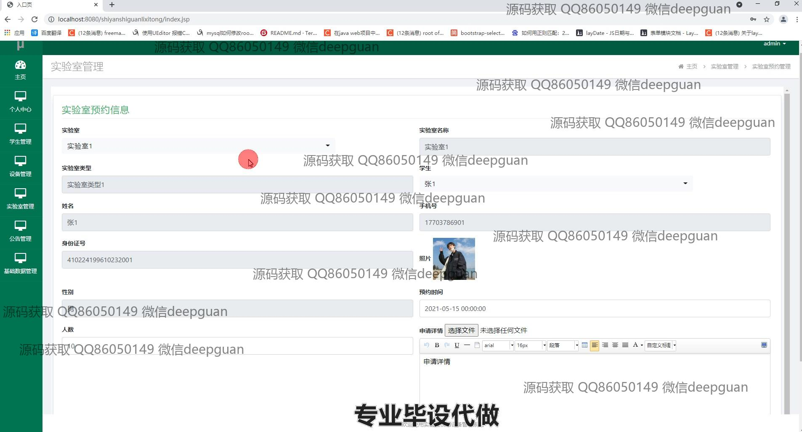
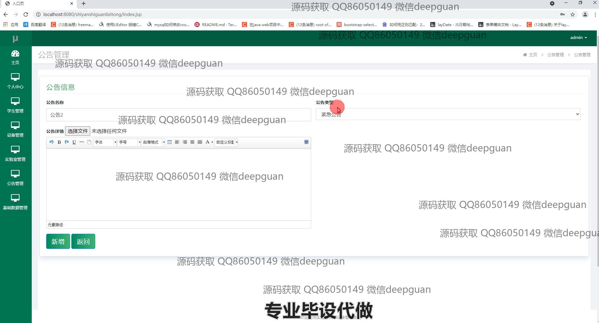
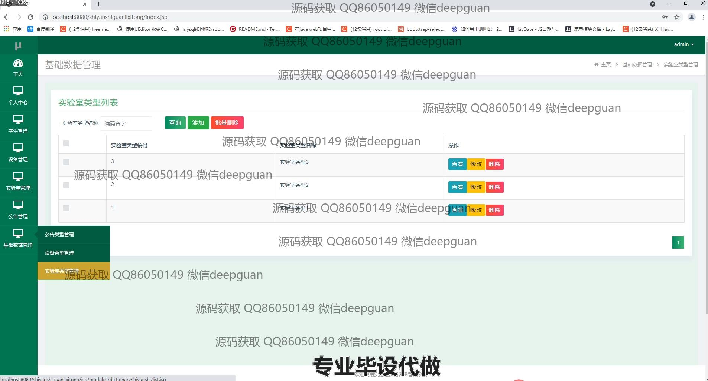
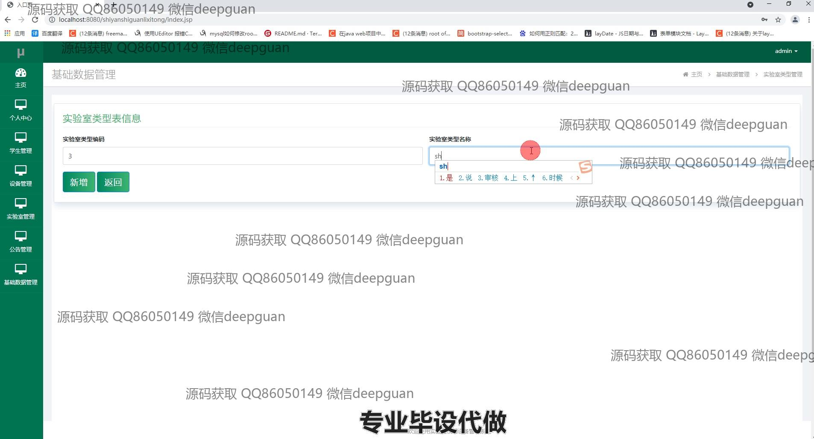
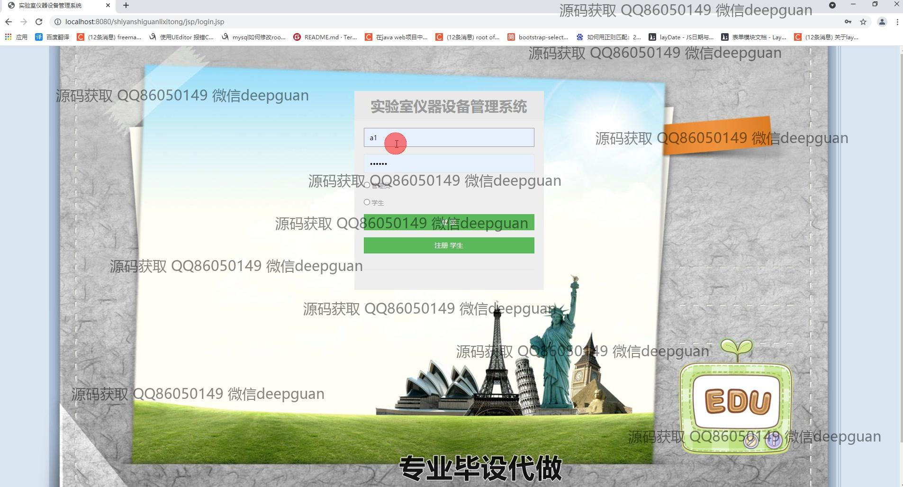
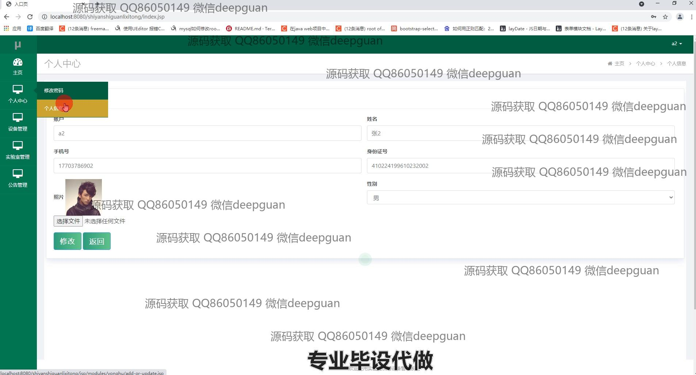
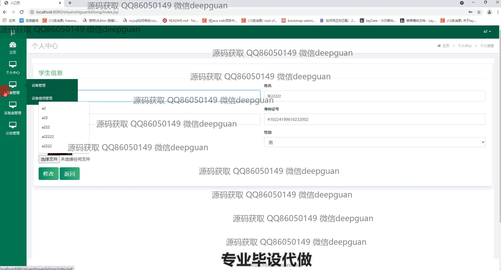
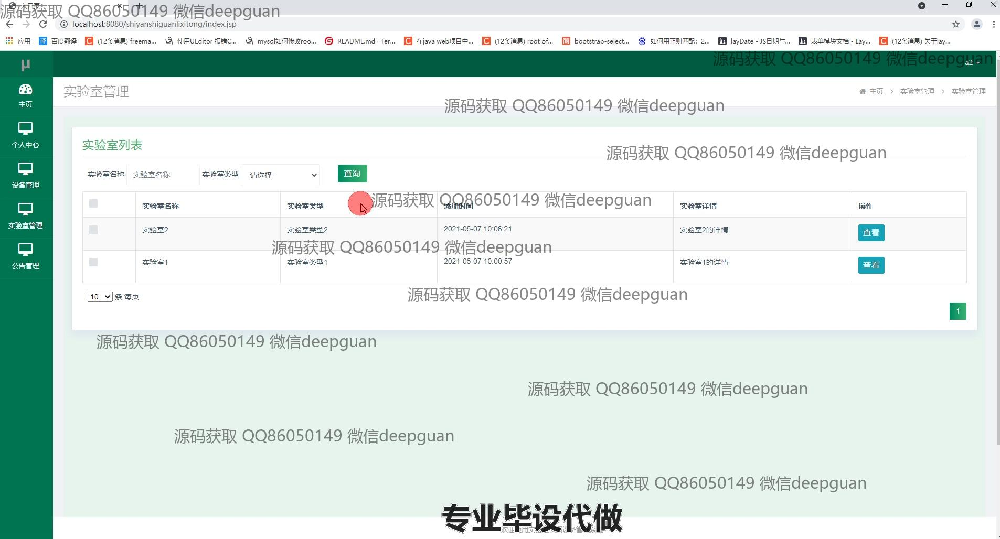
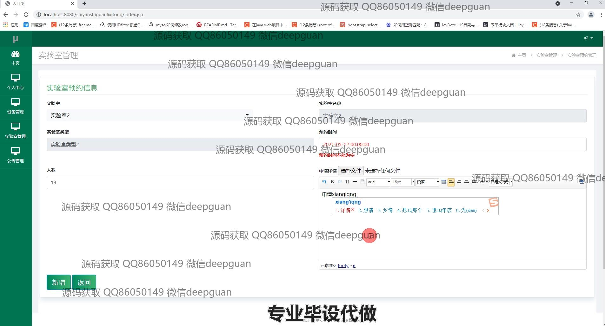
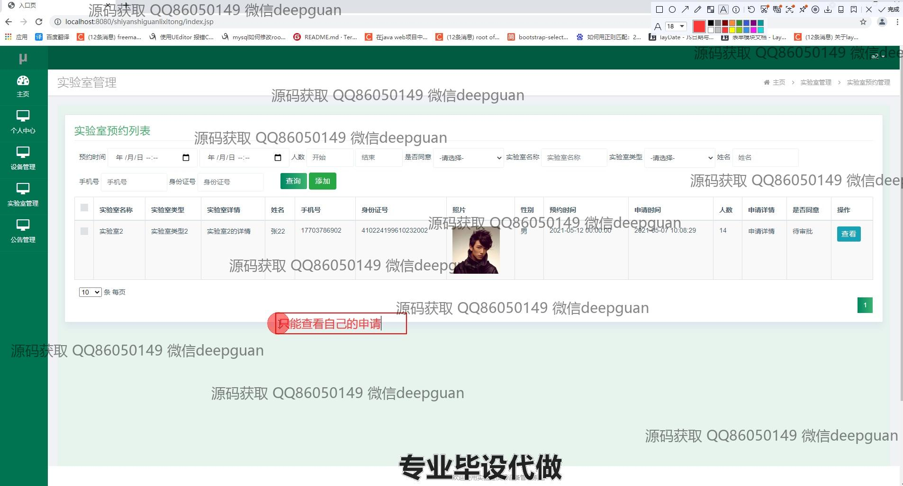
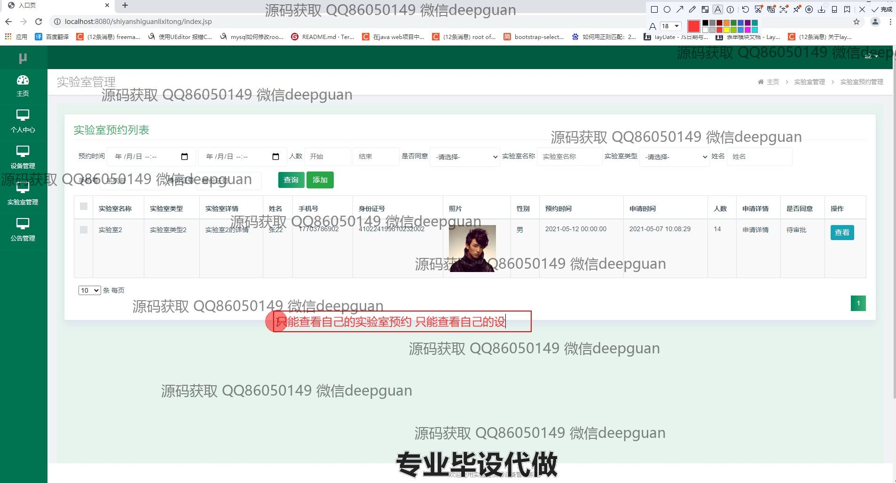

本代码来源于网络,仅供学习参考使用!

